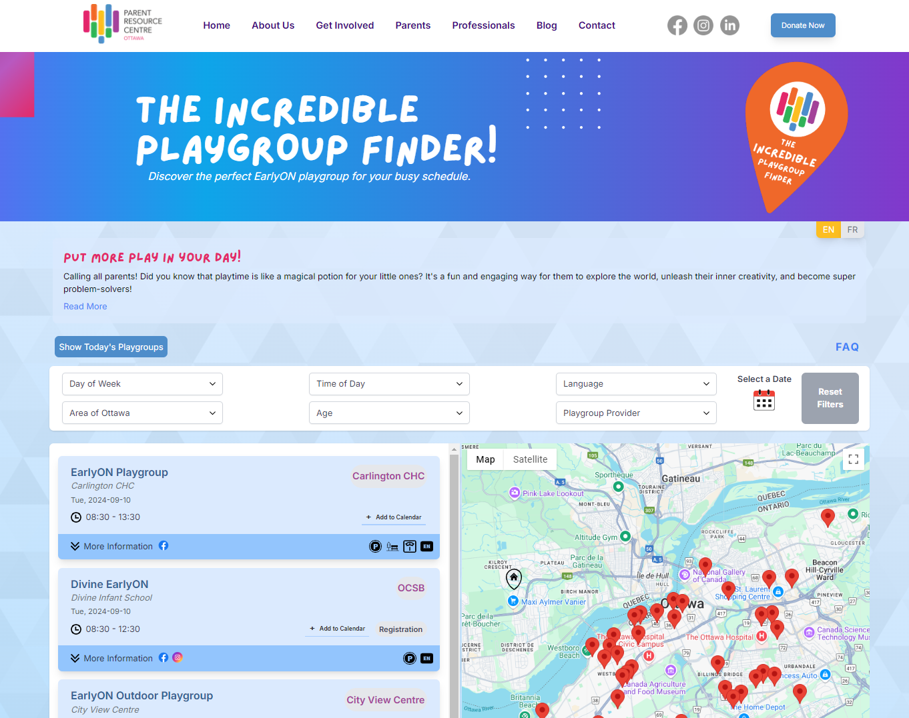
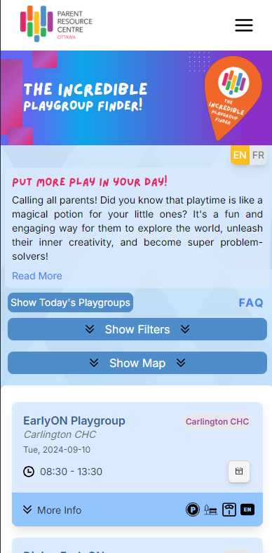
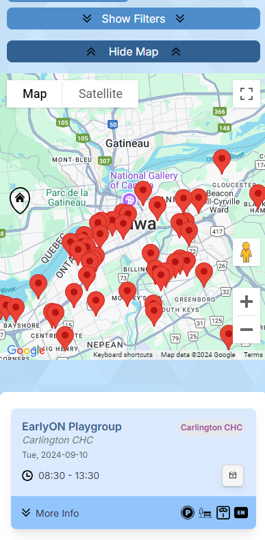
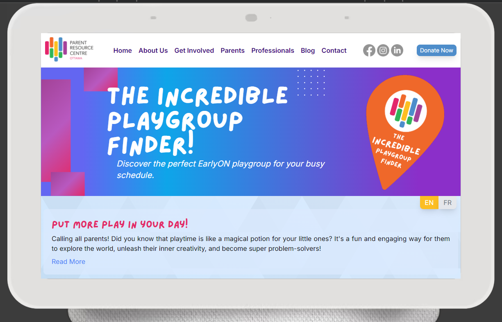
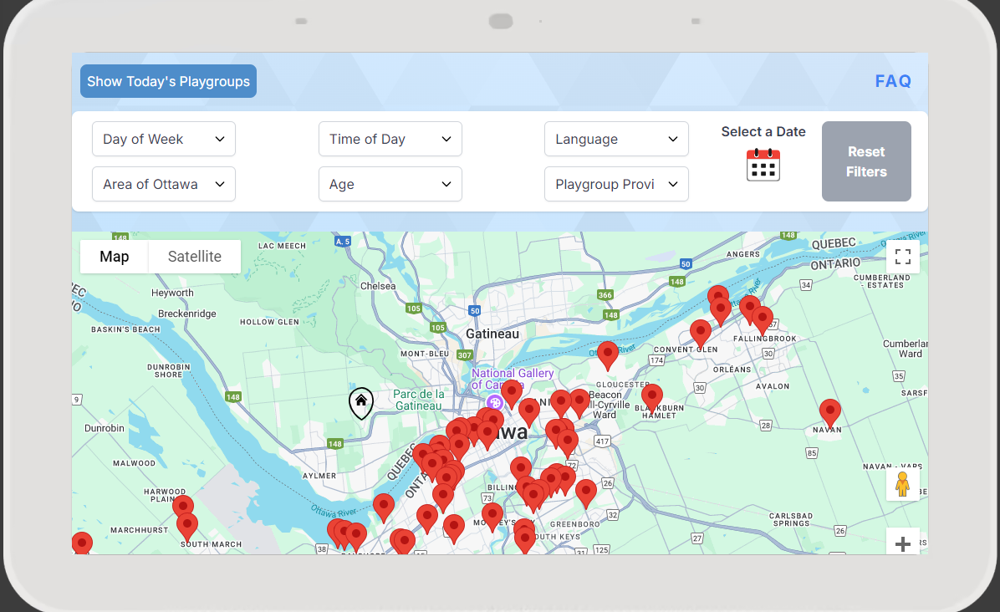
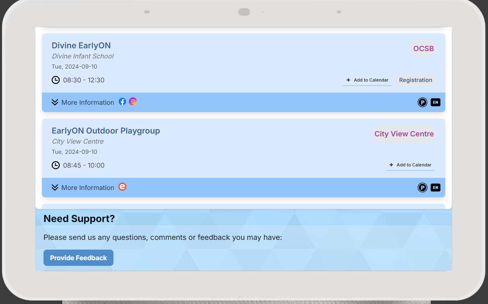

## The Incredible Playgroup Finder

www.incredibleplaygroupfinder.ca <br>
The Incredible Playgroup Finder is a web app that connects Ottawa parents with local playgroup events. With real-time data from Google Sheets, the app features an interactive map, filterable playgroup cards, calendar integration and it is Bilingual.

Our application stands out with its easy-to-use interactive map and a dynamic filtering system that allows users to search for playgroups by location, age group, language preference, date, day, and facility. Data is pulled in real-time from a Google Sheets database, ensuring the most current information is always at hand.

Key features include:

- **Interactive Map & Filters**: View and filter playgroup locations by criteria such as location, age group, language, date, and facility.
- **Real-time Data**: Always have the latest event details, updated directly from Google Sheets.
- **Responsive Design**: Enjoy a seamless experience across all devices—desktop, tablet, and mobile.
- **User-Friendly Features**: Includes user location detection, detailed event cards, direct navigation to Google Maps.
- **Bilingual Support**: The app supports both English and French languages.
- **Calendar Integration**: Option to add an event to calendar of your choice (Google, Outlook, Apple)
- **Interactive Slider**: Enjoy an engaging slider element with a car that changes the header background color as you slide it, culminating in a confetti celebration at the destination.
- **A Visually Appealing and Intuitive Design**: The overall design is visually appealing and user-friendly.

#### Project Overview

This project leverages the following technologies:

- **Tech Stack**: Next.js 14, Tailwind CSS
- **APIs**: Google Maps JavaScript API, Google Sheets API
- **Deployment**: Vercel
- **DataBase**: Google Spreadsheets

  ## Project View

  

  #### Desktop View

  

  #### Mobile View

  <div style="display: flex; justify-content: space-between;">
    
    
  </div>

#### Tablet View





#### Dependencies

```json
"dependencies": {
    "@react-google-maps/api": "^2.19.3",
    "@vercel/analytics": "^1.3.1",
    "add-to-calendar-button-react": "^2.6.16",
    "date-fns": "^4.1.0",
    "googleapis": "^133.0.0",
    "next": "14.1.0",
    "next-i18next": "^15.3.0",
    "next-sitemap": "^4.2.3",
    "react": "^18",
    "react-confetti": "^6.1.0",
    "react-datepicker": "^6.6.0",
    "react-dom": "^18",
    "react-icons": "^5.3.0",
    "react-use": "^17.5.1"
},
"devDependencies": {
    "autoprefixer": "^10.0.1",
    "eslint": "^8",
    "eslint-config-next": "14.1.0",
    "postcss": "^8",
    "tailwindcss": "^3.3.0"
},
"engines": {
    "node": "20.x"
}
```

### Project File Structure

```bash
├── public                      # Contains various icon images used in the project.
│   ├── docs                    # Contains the work log and related screenshots.
│   │   ├── SpreadSheetScript.md # Contains a copy of a script for the Spreadsheet with explanation
│   │   └── BackUpScript.md     # Contains a script to back up spreadsheet to Google Drive Folder
│   ├── fonts                   # Contains the Lazy Dog font file used in the project.
│   ├── sitemap.xml             # Search engines index the website
│   └── sw.js                   # Service worker script.
│
├── src
│   ├── actions
│   │   └── getSheetData.js     # Fetches and caches Google Sheets data, transforming it into objects
│   │
│   ├── app
│   │   ├── lang
│   │   │   └── page.js         # Language-specific homepage component, which dynamically adjusts content based on the URL language
│   │   ├── LICENSE
│   │   │   └── page.js         # MIT License file
│   │   ├── favicon.ico         # Favicon for the app
│   │   ├── fonts.css           # Defines font styles used in the project
│   │   ├── global.css          # Contains custom global CSS styles
│   │   ├── layout.js           # Sets up the root layout, initializes fonts, and manages language context
│   │   └── page.js             # Homepage component fetching data and rendering main content
│   │
│   ├── components
│   │   ├── Filter_Component
│   │   │   ├── ActiveFilters.js
│   │   │   ├── DatePickerComponent.js
│   │   │   ├── FilterComponent.js
│   │   │   ├── FilterContainer.js
│   │   │   └── ResetFiltersButton.js
│   │   │
│   │   ├── Header
│   │   │   ├── CarSlider.js
│   │   │   ├── HamburgerMenu.js
│   │   │   ├── Header.js
│   │   │   └── NavBar.js
│   │   │
│   │   ├── PlaygroupCard_Component
│   │   │   ├── AddToCalendar.js
│   │   │   ├── BasePlaygroupCard.js
│   │   │   ├── CardDetails.js
│   │   │   ├── CardFooter.js
│   │   │   ├── CardHeader.js
│   │   │   └── PlaygroupCard.js
│   │   │
│   │   ├── WeatherWidget
│   │   │   └── index.js         # Display weather for 5 days (not in use) 
│   │   │
│   │   ├── Background.js        # Background image file
│   │   ├── ContactForm.js       # Handles the contact form functionality
│   │   ├── Footer.js            # Contains the footer layout and content
│   │   ├── IntroductionText.js  # Displays the introductory text on the homepage
│   │   ├── LanguageSwitcher.js  # Manages language switching functionality
│   │   ├── Loading.js           # Displays a loading text
│   │   ├── MapComponent.js      # Manages the display and interaction with maps
│   │   ├── NoDataText.js        # Shows a message when no data is available
│   │   ├── RenderSheetDataTable.js # Renders and filters playgroup data fetched from Google Sheets, allowing users to toggle between map and list views, apply filters, and view additional playgroups dynamically.
│   │   ├── ShowTodayButton.js   # Toggles the display of today's events
│   │   └── ToggleButton.js      # A generic toggle button component
│   │
│   ├── context
│   │   └── LanguageContext.js   # Manages the language context for the application
│   │
│   └── utils
│       ├── applyFilters.js      # Utility for applying filters to data
│       ├── dateUtils.js         # Utility functions related to date handling
│       ├── geocodeAddress.js    # Utility for geocoding addresses
│       ├── gradient.js          # Utility for handling gradients
│       ├── handleDateChange.js  # Utility for managing date changes
│       ├── HotjarTracking.js    # Hotjar Tracking Code for IPF
│       ├── icons.js             # Utility for managing icons for PlaygroupCards footer
│       ├── RandomImage.js       # Utility for selecting random images ffor header
│       ├── Tooltip.js           # Displays a tooltip with custom text when the user hovers
│       ├── transformDataToObjects.js # Transforms sheet data into objects
│       ├── translationMapping.js # Manages translation mappings for filters
│       └── TTLCache.js          # Utility for handling time-to-live caching
│
├── .env.local.sample        # Sample environment file for local development
├── .gitignore               # Git ignore file, specifying files and directories to be excluded from version control.
├── LICENSE                  # MIT license
├── next-sitemap.config.js         
├── next.config.mjs          # Next.js configuration file, contains settings and customization options for the Next.js framework.
├── package.json             # Package manager configuration file
├── README.md                # Readme file
├── server.js                # Custom server file for Next.js, manages server-side operations and configurations beyond the default Next.js server.
└── tailwind.config.ts       # Tailwind CSS configuration file, customizes the utility-first CSS framework settings for the project.
```

## Running Locally with HTTPS

### Clone the repository to your local environment and install dependencies

Clone the repository to your local environment:

```bash
git clone [repository-url]
cd [repository-directory]
npm install
```

To run the app with HTTPS locally, you’ll need to generate self-signed SSL certificates. Follow the steps below to set it up:

### Step 1: Generate SSL Certificate and Private Key

Ensure that `OpenSSL` is installed on your machine. `OpenSSL` is required to generate the SSL certificate and key.
In your project root directory, create a folder named `certs` where your SSL certificates will be stored. Navigate to the newly created `certs` directory and run the following commands to generate the SSL certificate and private key:

```bash
cd certs

# Generate a private key
openssl genrsa -out localhost.key 2048

# Generate a certificate signing request (CSR)
openssl req -new -key localhost.key -out localhost.csr

# Generate the self-signed certificate, valid for 365 days
openssl x509 -req -days 365 -in localhost.csr -signkey localhost.key -out localhost.crt
```

During the certificate generation process, OpenSSL will prompt you to enter some details. You can either provide real information or leave them blank by entering a period (.).

### Step 2: Set Up Environment Variables

To connect to external services (Google Maps and Google Sheets), you will need to set up environment variables.
Create `.env.local` file and follow the `.env.local.sample` example add your API keys and credentials

### Step 3: Add the SSL Certificate Files to .gitignore

Ensure that the certificate and key files are not pushed to the repository. Add the following lines to your .gitignore file

### Step 4: Start the Development Server with HTTPS

Once the SSL certificate and key have been generated, you can start the development server. The server is already configured to use HTTPS with the generated certificate.

Run the following command:

```bash
npm run dev
```

Navigate to https://localhost:3000 in your browser to view the app. Since you're using a self-signed certificate, your browser may show a warning. You can proceed by clicking on "Advanced" and selecting "Proceed to localhost."

---

#### Development Resources

- Add To Calendar configuration: https://add-to-calendar-button.com/#demo
  - CSS configuration example: `styleLight="--btn-background: #2f4377; --btn-text: #fff; --font: Georgia, 'Times New Roman', Times, serif;"` https://github.com/add2cal/add-to-calendar-button/blob/main/assets/css/atcb-text.css
- React Date picker configuration: https://reactdatepicker.com/#example-custom-day
- Icons : https://uxwing.com/, https://iconduck.com/
- Address to GPS Coordinates: https://www.gps-coordinates.net/
- Background generators: https://www.svgbackgrounds.com/set/free-svg-backgrounds-and-patterns/, https://bgjar.com/, https://app.haikei.app/
- Web page audits: https://pagespeed.web.dev/, https://lighthouse-metrics.com/
- File Convertor: https://convertio.co/
- Hotjar numbers and user behavior behind- https://www.hotjar.com/

## License

This project is licensed under the MIT License - see the [LICENSE](./LICENSE) file for details.
