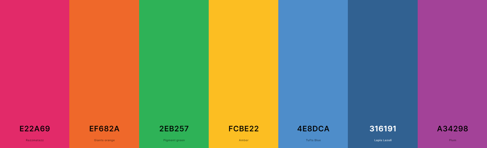

## Parent Resource Playgroup Finder application. 
www.incredibleplaygroupfinder.ca <br>
 Parent Resource Playgroup Finder is a user-friendly web application that connects parents in Ottawa with playgroup events suited for their children. Utilizing a real-time Google Sheets database, our application offers an interactive map, filterable playgroup cards and option to add aevents to your calendar for a tailored experience.


Our application stands out with its easy-to-use interactive map and a dynamic filtering system that allows users to search for playgroups by location, age group, language preference, date, day, and facility. Data is pulled in real-time from a Google Sheets database, ensuring the most current information is always at hand.

Key features include:
- **Interactive Map**: View playgroup locations across Ottawa, with the option to filter based on various criteria.
- **Real-time Data**: Playgroup information is continuously updated, providing the latest event details.
- **Filter Options**: Search for playgroups by location, age group, language, date, day, or name.
- **Responsive Design**: Whether on desktop or mobile, the experience is seamless.
- **User Location Detection**: With permission, the app will show your location on the map for convenience.
- **Detailed Event Information**: Reactive playgroup cards with detailed event information.
- **Direct Navigation**: Clicking an address takes you to Google Maps to easily find directions.
- **Date Picker**: React DatePicker is integrated for easy date selection.
- **Add To Calendar**: Option to add an event to calendar of your choice (Google, Outlook, Apple)


## Setup

Clone the repository to your local environment:

```bash
git clone [repository-url]
cd [repository-directory]
npm install
npm run dev
```
Navigate to http://localhost:3000 in your browser to view the app.


### Updates:
- add Google Map API
- Populate the spreadsheet with mock data.
- Connect to the spreadsheet API.
- Transform spreadsheet data into a key-object format.
- Create Playgroup cards.
- Add a "More Info" link to the website on each card.
- Add icons for time, address, and age on the Playgroup card.
- Include icons for amenities such as parking and WiFi.
- Add more columns for playgroup amenities (parking, WiFi - using Yes/No logic).
- Display additional information in a small pop-up box when a user hovers over an icon.
- Add latitude and longitude columns with data (develop logic to populate these for new addresses).
- Display markers using geolocation data.
- Display only one marker for duplicate addresses.
- Introduce advanced TTLCache for improved performance and reduced API call costs.
- Add a marker for the user's location (request permission).
- Center the map on the user's location (default to Ottawa's center if the user's location is unavailable).
- Add an info pop-up box when hovering over a marker.
- Create filters for location, language, day, and facility.
- Connect all filters to the markers on the map.
- Add a "reset filters" button.
- Add filters for:
  - Age (0-18, 18-30, 0-6?)
  - Time of day (morning, afternoon, evening)
- Add a "Show All" option for the filters, visible only when a user makes a selection (hidden by default).
- Implement logic for cancelled playgroups - add a column with Yes/No logic.
- Display a message when no data is found.
- Logic to display playgroups for today and future dates only (exclude past dates).
- Add a link to Google Maps routes on the address.
- Refactor filter styles to two rows and ensure responsiveness.
- Integrate React-datepicker to filter playgroups by date.
- Adjust date and time logic for Eastern Standard Time (EST).
- Add header text with an image.
- Make the calendar filter accessible via an icon.
- Move logo, Name and charts button to Navigation field.
- Make Name as a link, remove 'More Info'
- Add special Notes field box
- Create separate ellement for the small playgroup card
- Logic to extend small card to full card
- Style small card
- ADD arrows to roll big card to small again (^ Show Less)!!!
- Arrange the mobile layout with the map on top and Playgroup cards below.
- Hide filters in the mobile layout with a "Show Filter Options" button.
- Hide Map in the mobile layout with a "Show Map" button.
- More responsive changes: move notes field, arrange sizes and margins etc.
- Add a contact form at the bottom.(docs.google.com/forms)
- Make Map and Playgroup section 50/50 size
- A lot off small style and size adjustments.
- Add 'Show Today's Playgroups' button
- Make 'Show Today's Playgroups' filter and show groups for today
- Redirect user to playgroup cards section with data after pressing 'Show Today's Playgroups'
-  useMemo to reduce useState calls
- logic to show full date names in filter (in data they are short: Mon, Tue... etc.)
- Baby scale available icon adde with logic and tooltip + new column in DB
- reduce redundancy and simplify the code for LargePlaygroupCard and SmallPlaygroupCard by creating a common base component - BasePlaygroupCard
- visible list af active filters with delete filter option
- install npm addToCallendar packege
- implement addToCalendar button into the playcard footer (only for medium and bigger screens)
- adjust all AddToCallendar settings, style, position and options
- add logic to hide this button when group is cancelled
- apply color schema
- wrote a script for Google Spreadsheet for faster update the columns
- add and edit information to database

### Future Development
- more layout improvements
- sticky main field
- logic for add to the callendar option - in mobile screens
- Improve geolocation logic - check and generate longitude and latitude for addresses that are missing and populate the spreadsheet for future use.
- Use days of the week (Monday, Tuesday, etc.) to display recurring weekly playgroups. Consider shortening data entries but manage cancellations by adding a 'repetitive' column (Yes/No logic).
- Offer a French version.
- Incorporate charts.
- Consider deploying a server?
- Set up a Google Cloud account for PRC and ensure the spreadsheet contains proper data.
- Provide instructions on how to populate data in the spreadsheet.

```npm install @react-google-maps/api```
```npm install react-datepicker``` <br> 

#### Color Palate


Icons : https://uxwing.com/, https://iconduck.com/

## Learn More

To learn more about Next.js, take a look at the following resources:

- [Next.js Documentation](https://nextjs.org/docs) - learn about Next.js features and API.
- [Learn Next.js](https://nextjs.org/learn) - an interactive Next.js tutorial.